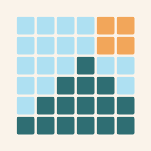
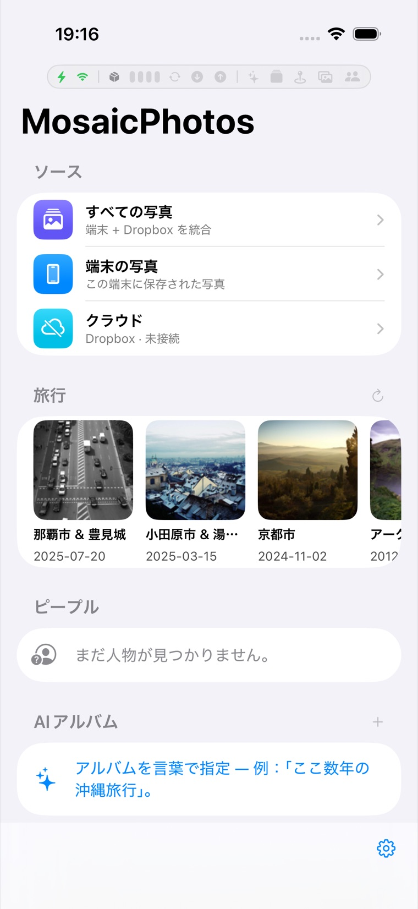
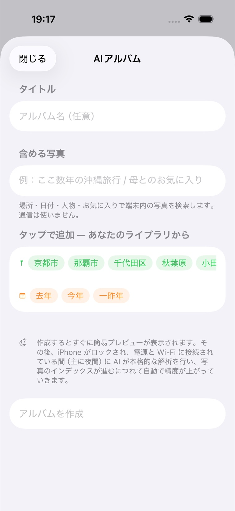
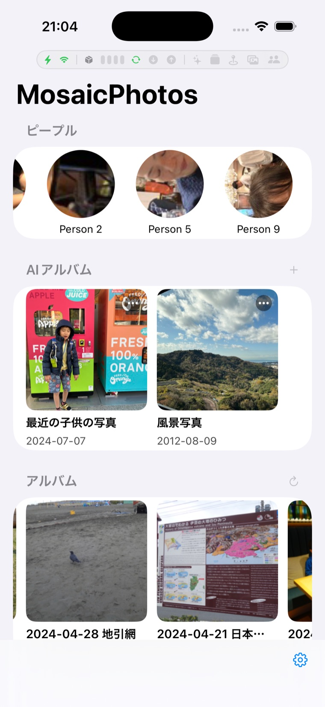
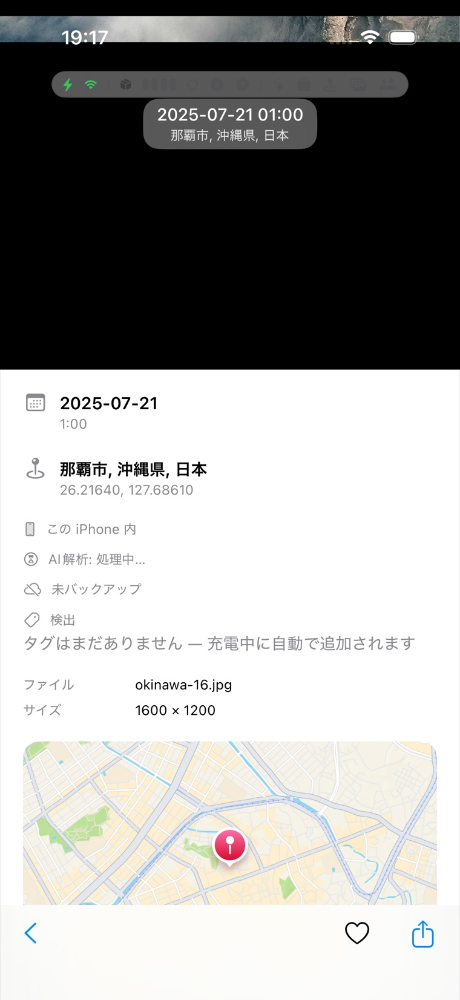
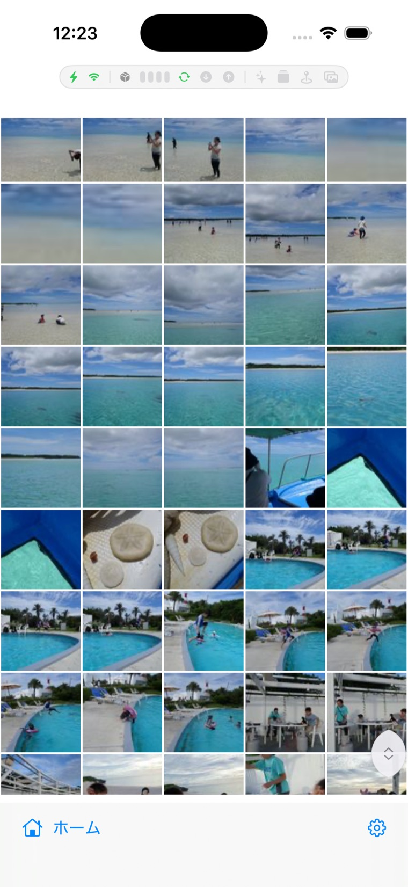
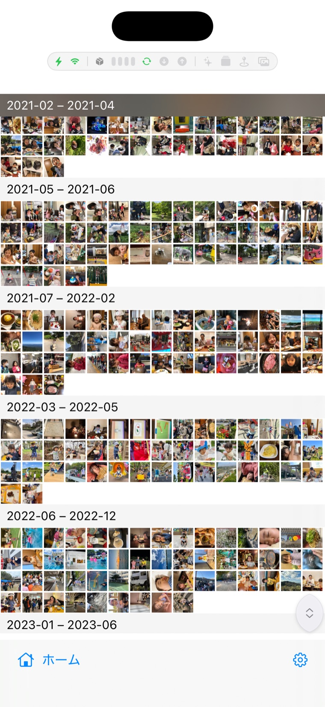
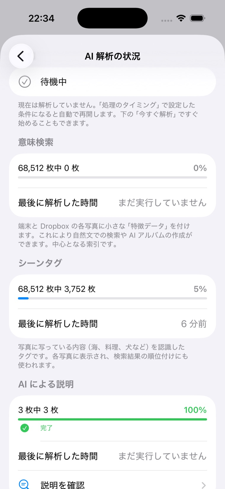
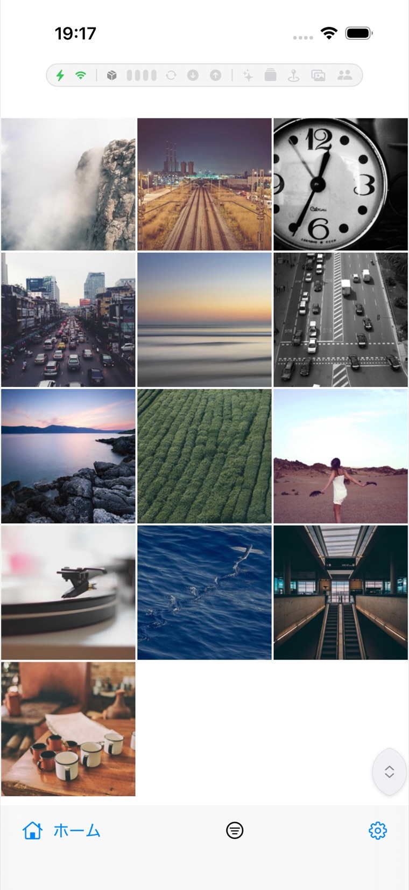

<p align="center">
  
</p>

<h1 align="center">MosaicPhotos</h1>

<p align="center">
  端末内の写真と <b>Dropbox</b> の写真を 1 つの体験に統合する、プライバシー重視の iOS 写真ビューワー。<b>外部 SDK・ライブラリは不使用</b>（コードはすべて標準 Apple フレームワーク）。AI はオープンソースの学習済みモデル（OpenCLIP / AuraFace）を同梱し、OS 内蔵の Core ML で実行します。
</p>

<p align="center">
  <a href="https://github.com/kanairyoji/MosaicPhotos/actions/workflows/ci.yml"></a>
  <a href="https://github.com/kanairyoji/MosaicPhotos/actions/workflows/codeql.yml"></a>
  <a href="LICENSE"></a>
  
  
  
  
  <a href="https://kanairyoji.github.io/MosaicPhotos/architecture-note/"></a>
</p>

<p align="center">
  <a href="README.md">English</a> | <b>日本語</b>
</p>

---

## 概要

**MosaicPhotos** は、iPhone 内の写真と Dropbox 上の写真を並べて閲覧できるアプリです。両者を統合した時系列ビュー、端末のアルバム、オンデバイスの**ピープル**（顔クラスタ）、写真を市区町村ごとにまとめる自動の **Places（場所）** ビューを、すっきりとした SwiftUI で提供します。Dropbox は OAuth 2.0 + PKCE で HTTP API に直接接続しており、Dropbox SDK もアナリティクスも使用していません。

## スクリーンショット

<table>
<tr>
<td align="center" width="50%">
  <br>
  <b>ホーム</b><br>
  <sub>端末と Dropbox の写真をひとつに。撮影日時と場所から自動でまとまる<b>旅行</b>アルバム、オンデバイスでクラスタリングされた<b>ピープル</b>も。</sub>
</td>
<td align="center" width="50%">
  <br>
  <b>AI アルバム — 言葉で作る</b><br>
  <sub>どんな写真かを普通の言葉で書くだけ。作成画面は<b>あなたのライブラリ由来のチップ</b>（人物・場所・よく写るもの・日付）を提案し、入力がどう解釈されるかを<b>その場で色付き表示</b>、条件に合う枚数も見えます。</sub>
</td>
</tr>
<tr>
<td align="center" width="50%">
  <br>
  <b>ピープル &amp; AI アルバム</b><br>
  <sub>顔検出・クラスタリングは完全オンデバイスで、<b>端末と Dropbox の両方</b>が対象。タップで人物の写真一覧、長押しで名前変更・<b>同一人物の統合</b>・代表写真の変更。名前を付けた人物は「太郎と花子の写真」のように AI アルバムで検索できます。</sub>
</td>
<td align="center" width="50%">
  <br>
  <b>写真情報 &amp; EXIF</b><br>
  <sub>写真を開くと場所・日付・EXIF（カメラ／レンズ／露出）と地図に加え、検出タグ・顔の数・スクリーンショット判定・**写真内のテキスト（OCR）**——すべてオンデバイス生成。全画面から**他アプリへ共有**でき、閲覧・共有の回数も記録して表示します。</sub>
</td>
</tr>
<tr>
<td align="center" width="50%">
  <br>
  <b>クラウド（Dropbox）</b><br>
  <sub>Dropbox の写真もピンチでサイズ変更できるグリッドで。差分同期で常に最新、サムネイルと本体はローカルにキャッシュ。</sub>
</td>
<td align="center" width="50%">
  <br>
  <b>月グループの密表示</b><br>
  <sub>写真の少ない月は範囲ヘッダー（例「2021-02 – 2021-04」）の下にまとめて密に表示。詰め具合は設定 → Photo Grid で調整できます。</sub>
</td>
</tr>
<tr>
<td align="center" width="50%">
  <br>
  <b>AI 解析の状況</b><br>
  <sub>オンデバイス AI が何をどこまで解析したかを可視化：パス別の進捗（意味検索・シーンタグ・ピープル）・最終実行時刻・「今すぐ解析」ボタン。</sub>
</td>
<td align="center" width="50%">
  <br>
  <b>高速グリッド＆フィルター</b><br>
  <sub>数万枚でもなめらかにスクロール。下部バーのフィルターボタンで、どのビューも「お気に入りのみ」「端末のみ／クラウドのみ」に絞り込めます。</sub>
</td>
</tr>
</table>

<sub>スクリーンショットは iOS シミュレータで撮影。</sub>

## 機能

- **すべての写真** — 端末と Dropbox の写真を 1 本の時系列タイムラインに統合。
- **どこでもフィルター** — すべてのグリッド（ソース・アルバム・ピープル・場所・AI アルバム）の下部バーにフィルターボタン。**お気に入りのみ**、混在ビューでは**端末のみ／クラウドのみ**にも絞れます。全画面のスワイプ送りも絞り込み後の並びで進みます。
- **ピープル** — 顔の検出とクラスタリングは**完全オンデバイス**：Vision 顔検出＋同梱顔モデル（**AuraFace-v1**・Apache 2.0・ArcFace 系 ResNet100・512 次元の identity 埋め込み・5 点整列）で「人物」を自動生成します（iOS に公開のピープル API は無いため独自実装・通信なし）。**端末と Dropbox の両方**が対象です（クラウドはキャッシュ済みサムネイルから検出＝追加ダウンロードなし）。認識精度は**データセット計測で調整**しており（`docs/architecture-note/records/face-accuracy.md`）、ぼやけ・横顔・暗所・小さすぎる顔・顔でないものを弾く多段ゲート、目の位置を揃えるアライメント、複数クロップ平均、紛らわしい顔を吸い込まないマージン制御で、別人が混ざる率を大きく下げています。ホームの丸アイコンから、タップで写真一覧（端末＋クラウド）、長押しで名前変更・代表写真・顔の管理・**別の人物と束ねる**。人物アルバムの**顔ハイライト**（下部バーの顔ボタン）で、認識した顔をサムネ・全画面に黄枠表示——複数人の写真でもどの顔かが分かります。**同じ人が複数に分かれたとき**（特に**成長した子供**）は 2 つ以上のグループを **1 人として束ねられます**（各グループの純度は保ったまま・撮影日で時期をまとめるので年齢推定は不要・後で解除可）。名前を付けた人物は AI アルバムの人物条件に接地します——「太郎と花子」で山田太郎・山田花子がヒットし、照合は**現在の人物でライブ評価**なので改名・束ねも即反映。顔モデル未同梱の構成ではセクション非表示。さらに、**複数の人物を「木村家」のような名前で束ねる『ピープルグループ』**も作れます（別人どうしをまとめる表示上のまとまりで、顔の認識結果自体は変わりません。カルーセル先頭に 2×2 の顔コラージュカードで表示され、タップで全員の写真、長押しで編集・クラウド共有）。
- **旅行** — 撮影日時と位置から旅行を自動検出（複数日・複数都市の旅行は 1 つのアルバムに）。タイトルとカバーも自動。
- **AI アルバム & 意味検索** — 自然文・**任意の言語**でアルバムを記述（例:「走っている子供」「京都か奈良の家族のお気に入り、スクショ除く」）。作成画面が入力を支援：ライブラリ由来の**サジェストチップ**（命名済み人物・頻出の場所・よく写るもの・日付の定型＝すべて確実にヒットする語）、入力の**接地プレビュー**（人物／場所／視覚語／日付にどう解釈されたかを色付きチップで表示）、ハード条件の**ヒット件数**のライブ表示。作成は **2 段階**：決定的**プレビュー**が 1〜2 秒で出て、そのまま**その場で本確定**（十数秒）——オンデバイス LLM（Apple Foundation Models）が**一度だけ**解釈して永続化し、**言い換えプローブ**（max-over-probes 採点で言い回しの取りこぼしを回収）を生成、**閾値レスの多層パイプライン**（校正済み**シーンタグ**一致＋**CLIP 対比**＋字句一致の RRF 融合 → **証拠ゲート** → **LLM 審査**・多数決）で照合します。「バレエの◯◯」のような人物×内容の複合は厳密な AND（ハード条件に接地済みの名前は内容照合から除外）。「人が写っていない」のような除外は**顔検出の実測**とタグ・CLIP を併用。**端末と Dropbox の両方**が対象。検索品質は**データセット計測**で決めます——COCO/Caltech の 123 クエリハーネス＋カテゴリ別回帰フロア（`docs/architecture-note/records/search-quality.md`）。
- **オンデバイス画像理解** — 写真は背景で**新しいものから先に**、2 パスで索引付けされます：**シーンタグ**（OS 内蔵 Vision・約 1,300 クラス・精度校正済み）と **CLIP 埋め込み**（OpenCLIP ViT-B-32・**INT8 量子化＝精度そのまま半分のサイズ**）を**全写真**へ。（VLM 説明文は 1.15 で廃止——網羅率アブレーションで検索寄与ゼロを計測し、最重量パスとモデル 877MB を削減。ADR-108）進捗は**設定 → AI 解析の状況**で確認できます（パス別進捗・最終実行時刻・「今すぐ解析」）。重い処理は既定で**充電中・Wi-Fi・非使用時（ロック中含む・BGProcessingTask）**のみ実行されます（下記の 4 軸設定）。外部 API なし・通信なし（OCR も OS 内蔵 Vision で端末内実行）。
- **写真** — PhotosKit による端末ライブラリの閲覧。高速なサムネイルキャッシュとピンチ対応グリッド。
- **クラウド** — Dropbox の写真閲覧。差分同期で常に最新、サムネイル（256px）と本体はローカルにキャッシュ。
- **アルバム** — 端末のユーザー作成アルバム（独立にスキャン・キャッシュ）。
- **場所** — **オンデバイス逆ジオコーディング**で市区町村ごとにグループ化。端末と Dropbox の位置情報つき写真を統合し、位置データが増えるほど自動で育ちます。
- **バックアップ — 検証つき・自動・家族共有対応** — 端末写真を Dropbox へ**内容ハッシュ検証つき**でバックアップ：アップロード後に Dropbox 側のバイト列一致を確認できたものだけ「済み」になります（同名衝突も同じ仕組みで検出し自動リネーム）。AI 索引と同じ**夜間ウィンドウ（充電＋Wi-Fi＋未使用時）に自動実行**され、設定に**「バックアップ済み X / Y」**、全画面表示に写真ごとのバッジを表示。保存先は**端末ごとのサブフォルダ**（例 `iPhone-3F2A8C`）なので、家族で 1 つの Dropbox を共有しても衝突しません。アルバム所属・お気に入り・人物名・GPS・AI 説明文も写真とともに保全——再インストールや将来の**オフロード**（端末容量の解放。検証つきのドライランプレビュー画面を先行搭載）に備えます。
- **クラウド共有 — 選んだ写真だけを、解析ごと分け合う** — アルバム・人物・ピープルグループの「…」から**クラウド共有**でセットを作ると、選んだ写真が Dropbox の共有フォルダへ**サーバー上でコピー**されます（写真データの再アップロードは発生せず、**原本とバックアップには一切触れません**）。相手が MosaicPhotos を使っていれば、**AI 解析（シーンタグ・CLIP 埋め込み・顔）も一緒に届く**ので、受け取った端末で解析し直す必要がありません——共有された子供の写真が、相手の端末の命名済み人物アルバムへ自動で合流します（結合キーは端末に依存しない `content_hash`）。**「受け取る」「提供する」「バックアップ」は独立した設定**で、受け取るだけなら Dropbox 接続だけで動きます（端末写真の提供のみバックアップが前提）。共有フォルダを誰に見せるかは Dropbox 側の操作（閲覧のみ招待を推奨）。

- **バックグラウンド・電池・通信** — 2 つの独立した設定で電池と通信量を管理します。
  - **処理のタイミング**（設定 → アルバムと検索 → アルバム自動処理）：重い AI 処理（シーンタグ・CLIP 埋め込み・顔スキャン・アルバム生成）を動かす条件。段階（梯子）ではなく**独立した設定の組み合わせ**で、「自動で解析する」（オン/オフ）と「画像分析を控えめに動かす」（既定 ON＝アプリ使用中は動かさない）の 2 つ。処理の**速さ**は別に 4 段階（とても控えめ／控えめ〈既定〉／バランス／高速）。低電力モード・メモリ逼迫時は常に停止します。
  - **バックグラウンドとバッテリー**（設定 → 一般）：残りの継続的バックグラウンド動作（Dropbox 同期・バックアップ・スキャン）のアプリ横断ポリシー。**電源**（充電中のみ〈既定〉／常に／オフ）と**通信**（モバイル可／**Wi-Fi のみ〈既定〉**／Wi-Fi・低データ除く／オフ）。閲覧中・開いている写真は常に取得され、制限されるのは自動の裏側の通信だけです。画面最上部の**アクティビティバー**（任意）で電源・通信・背景処理・Dropbox の動きを可視化できます。
- **大規模ライブラリ対応** — 数万枚を想定した設計：メタデータと画像ベクトルはページング＋コンパクト格納（Float16）。メモリ圧迫時は診断を記録しつつ**画像キャッシュを先回りで解放**（警告で縮小・危機で全解放）し、クラッシュせず安定を保ちます。

> 全ソース共通の表示モード：**dense／月／年**のグリッド、ピンチでサイズ変更、全画面ページング、EXIF 情報パネル（カメラ・絞り・ISO・焦点距離）。**月**表示は写真の少ない月を範囲ヘッダー（例「2024-01 – 2024-03」）の下へ密に詰めます。詰め具合は **設定 → General → Photo Grid** で調整できます。

## アーキテクチャ

アプリは責務ごとのローカル Swift Package Manager モジュールに分割されています。ロジック層は UI 非依存で、macOS の `swift test` で高速に単体テストできます。

```
MosaicPhotos (app)
├── MosaicSupport     横断ユーティリティ（ロギング・診断・メモリ予算）・依存なし
├── PhotoSourceKit    写真ソース共通インターフェイス（PhotoStore / PhotoItem / PhotoFilter）＋グリッド/ページングビュー
├── ImageCacheKit     画像キャッシュのプリミティブ（メモリ＋ディスク I/O）・SwiftUI 非依存
├── PerceptionCore    知覚の共通プリミティブ（ClipMath・PhotoRef・ANE 推論ゲート）
├── LocalPhotoCore    端末写真のロジック（PHAsset ストア・アルバム・サムネイルキャッシュ）
├── LocalPhotoKit     端末写真の UI（LocalPhotoCore に依存）
├── DropboxCore       Dropbox ロジック — OAuth/PKCE・HTTP API・同期エンジン・キャッシュ（SwiftUI 非依存）
├── DropboxKit        Dropbox の UI 層（DropboxCore に依存）
├── BackupKit         端末→Dropbox バックアップ：検証つきアップロード（content hash）・夜間自動・
│                     端末別フォルダ・オフロード台帳＋プレビュー／
│                     クラウド共有（共有セット・サーバーサイドコピー・解析サイドカー）
├── PhotosFeatureKit  ローカル＋Dropbox の統合（MergedPhotoStore）と場所グルーピング
├── FaceCore          顔認識・ピープル（検出ゲート・クラスタリング・ピープルグループ）
├── AutoAlbumCore     自動アルバム＋オンデバイス AI ロジック（SwiftUI 非依存）：旅行・フォルダ名アルバム・
│                     合成可能なクエリモデル（OR/NOT）・検索と融合・語彙接地・作成支援（サジェスト/接地プレビュー）
└── MobileCLIPKit     AI ランタイム＋AutoAlbumCore の seam 実装（CLIP・Vision シーンタグ・
                      顔モデル・表示ラベラ）
```

- **ロジック層 / UI 層の分離** — `DropboxCore`（ロジック）と `DropboxKit`（UI）は別パッケージ。`DropboxCore` は SwiftUI を import しません。
- **DI の seam** — ネットワーク（`HTTPClient`）・時刻（`DateProvider`）・トークン（`AccessTokenProvider`）はプロトコル。同期エンジン・バッチャ・認証・バックアップはネットワークなしでテストできます。

### オンデバイス AI の仕組み

AI はすべて **`AutoAlbumCore`**（SwiftUI 非依存）にあり、アプリがオンデバイス実装を注入します。

- **埋め込み** — 各写真（端末も Dropbox も）を **OpenCLIP ViT-B-32（DataComp）**（Core ML・512 次元・**INT8 重み量子化**＝289→145MB。精度は Core ML ベンチで 75.0→76.0% と不変を確認）で 1 回だけエンコード。ベクトルは**別テーブル（`PhotoEmbedding`）に Float16** で格納し、メタデータ取得で blob を読みません。`PhotoTagger` が背景で小バッチ・スロットル付きで埋め、**新しい写真から先に**処理します（撮りたての写真が検索に最速で反映）。クラウド写真はキャッシュ済み 256px サムネイルから埋め込みます。
- **シーンタグ** — CLIP と並行して、全写真に OS 内蔵 Vision 分類器の**シーンタグ**（約 1,300 クラス・`hasMinimumRecall(forPrecision:)` の校正済み足切り＝自前閾値なし）。モデルの採用も**廃止も**実測で決めます：VLM 説明文（SmolVLM-500M）は数バージョン同梱したのち、**網羅率アブレーションで検索寄与ゼロを計測して廃止**しました（ADR-108・−877MB）。[`records/model-evaluations.md`](docs/architecture-note/records/model-evaluations.md) / [`records/search-quality.md`](docs/architecture-note/records/search-quality.md) 参照。
- **2 段階のアルバム作成** — 作成直後に**決定的プレビュー**（レキシコン＋日付＋タグ照合・LLM なし・1〜2 秒）、そのまま**その場で本確定**（LLM 解釈＋言い換えプローブ＋証拠ゲート＋LLM 審査・十数秒）。広い語の語彙接地は重心キャッシュがコールドの場合のみ次の背景ウィンドウで仕上げます。作成画面は**ライブラリ由来のサジェストチップ**・**接地プレビュー**・**ヒット件数**で入力を支援——本番検索と同じ決定的レイヤーで駆動されるため、プレビューが実際とズレません。
- **解釈** — 検索文の解釈は**作成時に 1 回だけ**（Apple Foundation Models・guided generation）実行し版付きで永続化。小型 LLM の構造化出力は信頼できないため、決定的レイヤーで防御的に接地します：日付は `RelativeDateParser`（日英）のみ、場所はカタログ/原文接地、人物名は顔クラスタに接地（`PersonNameGrounder`——「太郎」→山田太郎。照合は**ライブ**なので改名・統合が即反映）、`JapaneseVisualLexicon` が頻出視覚語と人物否定を LLM 非依存で抽出。LLM は**言い換えプローブ**（最大 4）も生成して永続化し、意味採点は max-over-probes——言い換えの取りこぼしを実測 +17pt 回収します。
- **検索** — ハード条件（`QueryEvaluator`）で絞り、**タグ一致**（離散・閾値レス）＋**CLIP 対比**（除外は肯定/否定ベクトルの相対判定のみ。除外つきアルバムではプローブ無効＝対比を緩めない）＋字句一致を **Reciprocal Rank Fusion** で融合。除外つきは**証拠ゲート**（タグ／顔実測／人数実測のいずれか必須）を通し、最後に **LLM 審査**（`AlbumVerifier`）が証拠行から keep/drop 判定（unsure は最大 2 回再判定の多数決）。再評価は増分——新規索引分だけ採点して永続プールへマージ。品質は **COCO/Caltech の 123 クエリハーネス＋カテゴリ別 F1 回帰フロア**（`SearchEvalTests` / `SearchEvalRegressionTests`・実パイプライン実行）で回帰監視しています。
- **seam** — 知覚（`PhotoPerceptionProvider`・`TagPerceptionProvider`・`FacePerceptionProvider`）、テキスト（`TextEmbedder`・`QueryTranslator`）、審査（`AlbumCandidateVerifier`）は `AutoAlbumCore` のプロトコルで、**`MobileCLIPKit`** が実装、アプリの Composition Root が結線します。`PhotoSourceKit` は AI を知らず、写真ごとの情報は `photoInsight` 環境クロージャで受け取ります。

## ドキュメント

設計判断（ADR）・深掘り実装ページ（並行性・キャッシュ・データモデル）・モデル評価記録・汎用 AI 入門を含む**設計資料**を、複数ページの HTML サイトとして公開しています：

- **[設計資料 → kanairyoji.github.io/MosaicPhotos/architecture-note](https://kanairyoji.github.io/MosaicPhotos/architecture-note/)** — GitHub Pages で公開（図は Mermaid）。ソース: [`docs/architecture-note/`](docs/architecture-note/)。エンドユーザー向け**[ヘルプ](https://kanairyoji.github.io/MosaicPhotos/help/)**も公開しています（ソース: [`docs/help/`](docs/help/)）。

> 正本（マスター）は `docs/architecture-note/records/` の Markdown（ADR・事例・モデル評価）です。

## 技術スタック

| 領域 | 技術 |
|---|---|
| 言語 / UI | Swift · SwiftUI |
| 状態管理 | Swift Observation（`@Observable`） |
| 端末写真 | PhotosKit（`PHPhotoLibrary`・`PHImageManager`） |
| Dropbox 認証 | `AuthenticationServices`（`ASWebAuthenticationSession`・OAuth 2.0 + PKCE） |
| トークン保存 | Keychain Services |
| Dropbox API | `URLSession` async/await（SDK 不使用） |
| キャッシュ | SwiftData（メタデータ）＋独自バイナリキャッシュ（LRU 破棄） |
| オンデバイス AI | Vision 画像分類（OS 内蔵・約 1,300 クラス）· OpenCLIP ViT-B-32（DataComp/MIT・INT8）埋め込み · AuraFace-v1 顔埋め込み＝ピープル（Apache 2.0・任意）— すべて Core ML · 解釈/翻訳/プローブ生成/審査は Apple Foundation Models |
| 最小 OS | iOS 26 |
| パッケージ | Swift Package Manager（ローカル 13 パッケージ） |

## プライバシーとセキュリティ

- **サードパーティ SDK なし** — すべて Apple 標準フレームワーク。
- Dropbox は **OAuth 2.0 + PKCE**。アクセス／リフレッシュトークンは **Keychain** に保存（平文ファイルなし）。
- **オンデバイス処理** — 逆ジオコーディング・EXIF 解析・AI（タグ／埋め込み／顔／LLM）はすべて端末内。
- 解析・トラッキングなし。

## ビルドとテスト

```bash
# ビルド（iOS シミュレータ）
xcodebuild -project MosaicPhotos.xcodeproj -scheme MosaicPhotos -sdk iphonesimulator build

# テスト一式（パッケージ: macOS fast ＋ iOS シミュレータ）
scripts/test.sh all

# サブセット
scripts/test.sh fast   # macOS swift test（純ロジック）
scripts/test.sh ios    # iOS シミュレータのパッケージテスト
```

### オンデバイス AI モデル（任意）

AI モデルは（サイズのため）**コミットされていません**。ローカルで生成します。未同梱でもアプリは完全に動作し、対応する AI 機能だけが無効になります（日付・場所・人物の条件絞り込みは動作します）。

```bash
bash scripts/build_mobileclip.sh   # OpenCLIP ViT-B-32（DataComp・MIT）→ Core ML・INT8（意味検索・タグ）
bash scripts/build_auraface.sh     # AuraFace-v1（Apache 2.0）→ Core ML（ピープル）
```

## ライセンス

ソースコードは **GNU Affero General Public License v3.0 or later（AGPL-3.0-or-later）** で配布します（[LICENSE](LICENSE) 参照）。

**デュアル配布:** AGPL に加えて、著作権者（Ryoji KANAI）はコンパイル済みアプリを Apple App Store で Apple 標準条件のもと配布します（[NOTICE](NOTICE) 参照）。コントリビュートは DCO ＋ 再ライセンス許諾のもとで受け付けます（[CONTRIBUTING.md](CONTRIBUTING.md)）。

第三者の資産はアプリ内 **設定 → ライセンス**（および `MosaicPhotos/Settings/Licenses.swift`）に一覧表示します：同梱 CLIP モデルは **OpenCLIP ViT-B-32（DataComp・MIT）**、CLIP の BPE 語彙／トークナイザ（MIT）、ビルドツール（coremltools・PyTorch・open_clip・transformers・Pillow・NumPy）、Mermaid（ドキュメント）。Apple SDK と SF Symbols は Apple の条件に従います。
