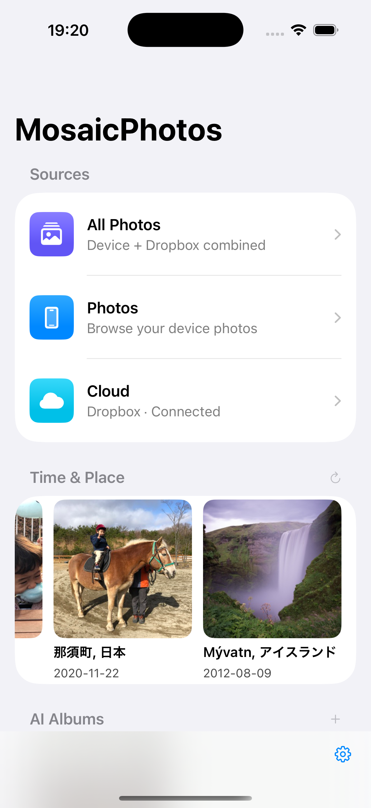
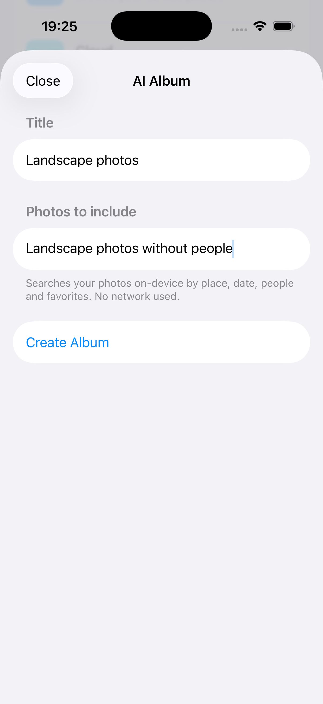
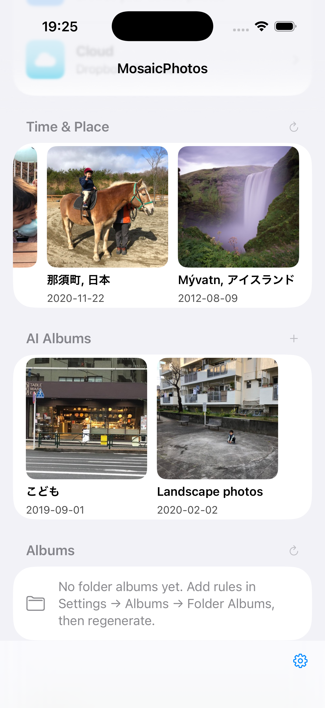
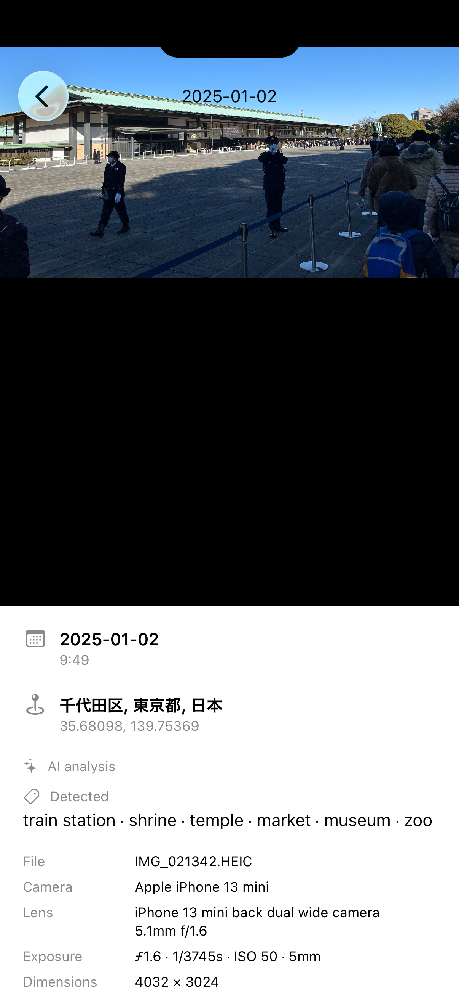
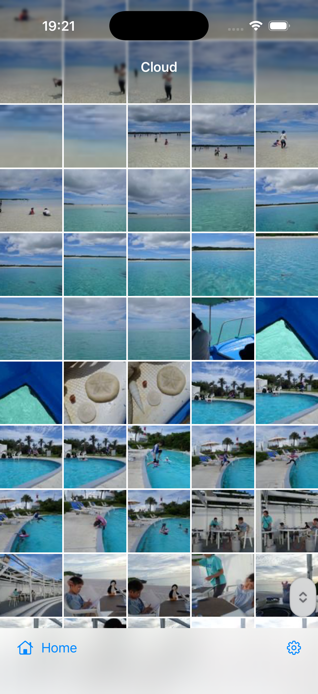

<p align="center">
  
</p>

<h1 align="center">MosaicPhotos</h1>

<p align="center">
  A privacy-first iOS photo viewer that unifies your <b>device library</b> and <b>Dropbox</b> into one experience — built entirely with standard Apple frameworks, <b>no third-party SDKs</b>.
</p>

<p align="center">
  <a href="https://github.com/kanairyoji/MosaicPhotos/actions/workflows/ci.yml"></a>
  
  
  
  
</p>

<p align="center">
  <b>English</b> | <a href="README.ja.md">日本語</a>
</p>

---

## Overview

**MosaicPhotos** lets you browse the photos on your iPhone and the photos stored in your Dropbox side by side: a single merged timeline, your device albums, and an automatic **Places** view that groups photos by city — all in a clean SwiftUI interface. Dropbox is integrated directly over its HTTP API with OAuth 2.0 + PKCE; there is no Dropbox SDK and no analytics.

## Screenshots

<table>
<tr>
<td align="center" width="50%">
  <br>
  <b>Home</b><br>
  <sub>Your device and Dropbox photos in one place — plus <b>Time&nbsp;&amp;&nbsp;Place</b> trips grouped automatically from when and where they were taken.</sub>
</td>
<td align="center" width="50%">
  <br>
  <b>AI Albums — describe it</b><br>
  <sub>Describe an album in plain words, in any language (e.g. “Landscape photos without people”). Interpreted and searched on-device with open-vocabulary CLIP.</sub>
</td>
</tr>
<tr>
<td align="center" width="50%">
  <br>
  <b>AI &amp; folder albums</b><br>
  <sub>Your description becomes a living album that fills in as the library is indexed. Albums inferred from Dropbox folder names appear here too — dates in the folder name are parsed so they group as “name (year)”.</sub>
</td>
<td align="center" width="50%">
  <br>
  <b>Detected tags &amp; info</b><br>
  <sub>Open any photo for on-device CLIP keyword tags, place, date, and full EXIF (camera, lens, exposure).</sub>
</td>
</tr>
<tr>
<td align="center" colspan="2">
  <br>
  <b>Cloud (Dropbox)</b><br>
  <sub>Browse Dropbox photos in a pinch-to-resize grid. Background delta sync keeps it fresh; thumbnails and originals are cached locally.</sub>
</td>
</tr>
</table>

<sub>Screenshots captured in the iOS Simulator.</sub>

## Features

- **All Photos** — Your device and Dropbox photos merged into one chronological timeline.
- **Time & Place** — Trips are detected automatically from capture time and location (multi-day, multi-city trips become a single album), with smart titles and covers.
- **AI Albums & semantic search** — Describe an album in natural language, in **any language** (e.g. “走っている子供” / “a running child”, or “Kyoto or Nara family favorites, no screenshots”). The query is normalized to English **on-device** (Apple Foundation Models, with a fallback) and matched with **open-vocabulary CLIP image understanding** (MobileCLIP via Core ML) — no fixed keyword list — combined with **composable structured conditions** (date / place / people / source / favorite / screenshot / orientation) that support **OR and NOT** (a DNF `QuerySpec`). Relative dates (“last 2 years”) are understood too. Works across **both device and Dropbox** photos.
- **On-device image understanding** — Every photo (device and Dropbox) gets a CLIP image embedding in the background for semantic search; the full-screen info panel shows **detected keyword tags** (display-only zero-shot labels). No OCR, no third-party vision API. Background indexing has selectable **speed levels** (gentle → fast) to balance battery, network, and scrolling.
- **Photos** — Browse your on-device library via PhotosKit, with fast thumbnail caching and a pinch-to-resize grid.
- **Cloud** — Browse Dropbox photos. Background delta sync keeps the list fresh; thumbnails and originals are cached locally.
- **Albums** — Your user-created device albums, scanned and cached independently.
- **Places** — Photos grouped by city using **on-device reverse geocoding**, combining located photos from both the device and Dropbox. Grows automatically as more location data arrives.
- **Settings & Backup** — Connect Dropbox, tune cache limits, and back up device photos to Dropbox (with people / album / favorite metadata).
- **Background work, battery & data** — Continuous/periodic background work (AI indexing, automatic albums, scanning, Dropbox sync, backup) is gated by **power** and **network** policies to save battery and cellular data. Defaults: run **only while charging** (Low Power Mode off) and use **Wi-Fi only**; both are configurable (Settings → General → Background & Battery). Photos you open or browse are always fetched — only automatic background traffic is limited. CLIP indexing is smart: on cellular it keeps indexing local photos and defers cloud photos to Wi-Fi. An optional top-of-screen **activity bar** visualizes power/network state and live background/Dropbox activity.

> Viewing modes shared across every source: **dense**, **month**, and **year** grid layouts, pinch-to-resize, full-screen paging, and an EXIF info panel (camera, aperture, ISO, focal length).

## Architecture

The app is split into focused local Swift Package Manager modules. Logic layers are UI-free so they can be unit-tested on macOS with `swift test`.

```
MosaicPhotos (app)
├── MosaicSupport     cross-cutting utilities (logging), no dependencies
├── PhotoSourceKit    shared photo-source interface (PhotoStore / PhotoItem) + grid & paging views
├── ImageCacheKit     image cache primitives (memory + disk I/O), SwiftUI-free
├── LocalPhotoCore    device-photo logic (PHAsset store, albums, thumbnail cache)
├── LocalPhotoKit     device-photo UI (depends on LocalPhotoCore)
├── DropboxCore       Dropbox logic — OAuth/PKCE, HTTP API client, sync engine, cache (SwiftUI-free)
├── DropboxKit        Dropbox UI layer (depends on DropboxCore)
├── BackupKit         device → Dropbox backup engine
├── PhotosFeatureKit  merges local + Dropbox (MergedPhotoStore) and place grouping
├── AutoAlbumCore     auto albums + on-device AI logic (SwiftUI-free): Time & Place trips,
│                     folder-name albums, composable query model (OR/NOT), search & fusion
└── MobileCLIPKit     CLIP/translation runtime + AutoAlbumCore seam implementations
                      (MobileCLIPRuntime, perception/language adapters, display labeler)
```

- **Logic vs. UI separation** — `DropboxCore` (logic) and `DropboxKit` (UI) are separate packages; `DropboxCore` never imports SwiftUI.
- **Dependency-injection seams** — networking (`HTTPClient`), time (`DateProvider`), and tokens (`AccessTokenProvider`) are protocols, so the sync engine, batcher, auth, and backup are testable without the network.

### On-device AI — how it works

All AI lives in **`AutoAlbumCore`** (SwiftUI-free); the app injects the on-device implementations.

- **Embeddings** — Each photo (device *and* Dropbox) is encoded once with **MobileCLIP-S2** (Core ML, 512-dim) into a normalized image vector. Vectors live in a **separate SwiftData table (`PhotoEmbedding`) stored as Float16**, so metadata fetches never load the blobs (this fixed a photo-count-proportional launch crash). A `PhotoTagger` fills these in the background in small throttled batches (`.background` QoS; speed is user-selectable). Cloud photos are embedded from their cached thumbnails.
- **Search** — A query (any language) is normalized to English by **Apple Foundation Models** (`QueryTranslator`), embedded with the CLIP *text* encoder, and ranked by cosine similarity against the stored image vectors (`SemanticRanker`). This is **open-vocabulary** — no fixed keyword list. In parallel, the query is parsed into structured filters (date / place / people) and a lexical match (place / person names); the three signals are merged with **Reciprocal Rank Fusion** (`AIAlbumSearcher`).
- **Display tags** — The full-screen info panel shows keyword tags via a separate **display-only** zero-shot step (`CLIPDisplayLabeler`): the stored image vector is compared against ~300 everyday English concepts. This never constrains search, which stays vocabulary-free.
- **Seams** — `PhotoPerceptionProvider` (image → CLIP), `TextEmbedder` (text → CLIP), `QueryTranslator`, and `LabelProvider` are protocols in `AutoAlbumCore`; **`MobileCLIPKit`** implements them with `MobileCLIPRuntime` and `FoundationModels`, and the app's composition root wires them in. `PhotoSourceKit` stays unaware of AI and receives per-photo info through a `photoInsight` environment closure.

## Documentation

An in-depth internal **architecture note** — design rationale (ADR), deep-dive implementation pages (concurrency, caching, data model), and a general, app-independent AI primer — is available as a multi-page HTML site:

- **[Architecture Note → kanairyoji.github.io/MosaicPhotos](https://kanairyoji.github.io/MosaicPhotos/)** — published via GitHub Pages (diagrams via Mermaid). Source: [`docs/architecture-note/`](docs/architecture-note/).

> ⚠️ **The architecture note is written in Japanese only.** Its master records live as Markdown in `docs/architecture-note/records/`.

## Tech Stack

| Area | Technology |
|---|---|
| Language / UI | Swift · SwiftUI |
| State | Swift Observation (`@Observable`) |
| Device photos | PhotosKit (`PHPhotoLibrary`, `PHImageManager`) |
| Dropbox auth | `AuthenticationServices` (`ASWebAuthenticationSession`, OAuth 2.0 + PKCE) |
| Token storage | Keychain Services |
| Dropbox API | `URLSession` async/await (no SDK) |
| Caching | SwiftData (metadata) + custom binary cache with LRU eviction |
| On-device AI | MobileCLIP image/text embeddings (Core ML) for open-vocabulary search · Apple Foundation Models for query understanding & translation |
| Minimum OS | iOS 26 |
| Packaging | Swift Package Manager (11 local packages) |

## Privacy & Security

- **No third-party SDKs** — everything uses standard Apple frameworks.
- **OAuth 2.0 + PKCE** for Dropbox; access/refresh tokens are stored in the **Keychain**, never in plain files.
- **On-device processing** — reverse geocoding and EXIF parsing happen locally.
- No analytics, no tracking.

## Build & Test

```bash
# Build (iOS Simulator)
xcodebuild -project MosaicPhotos.xcodeproj -scheme MosaicPhotos -sdk iphonesimulator build

# Run the full test suite (packages + app target) — 270+ tests
scripts/test.sh all

# Subsets
scripts/test.sh fast   # macOS swift test (pure logic)
scripts/test.sh ios    # iOS Simulator package tests
scripts/test.sh app    # app-target unit tests
```

### On-device AI model (optional)

Semantic search and the detected keyword tags use **MobileCLIP** (Core ML). The model is **not committed** (size) and is generated locally:

```bash
bash scripts/build_mobileclip.sh   # converts MobileCLIP-S2 → MosaicPhotos/MobileCLIP/ (~250 MB)
```

Without the model the app still runs fully; only CLIP-based semantic search and keyword tags are disabled (structured filters by date/place/people keep working).

## License

Source code is licensed under the **GNU Affero General Public License v3.0 or later (AGPL-3.0-or-later)** — see [LICENSE](LICENSE).

**Dual distribution:** in addition to the AGPL, the copyright holder (Ryoji KANAI) also distributes the compiled app via the Apple App Store under Apple's standard terms (see [NOTICE](NOTICE)). Contributions are accepted under the DCO with a relicensing grant — see [CONTRIBUTING.md](CONTRIBUTING.md).

Third-party assets are listed in-app under **Settings → Licenses** (and in `MosaicPhotos/Settings/Licenses.swift`): MobileCLIP (Apple — code MIT, **weights research-only**), the CLIP BPE vocabulary / tokenizer (MIT), build tools (coremltools, PyTorch, open_clip, Pillow, NumPy), and Mermaid (docs). Apple SDKs and SF Symbols are used under Apple's terms.

> ⚠️ The MobileCLIP **weights** are research-only and not App-Store/commercial-redistributable; a permissively-licensed model is needed before shipping a bundled build (planned separately).
