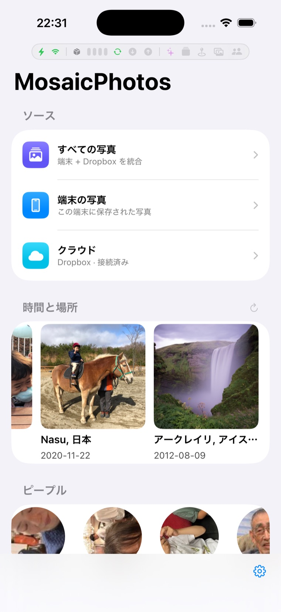
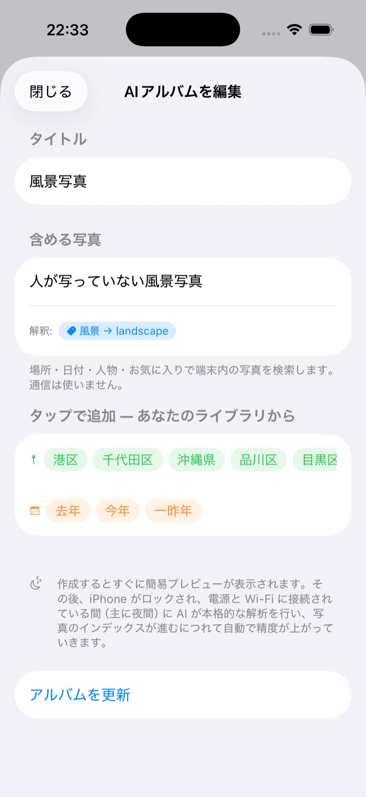
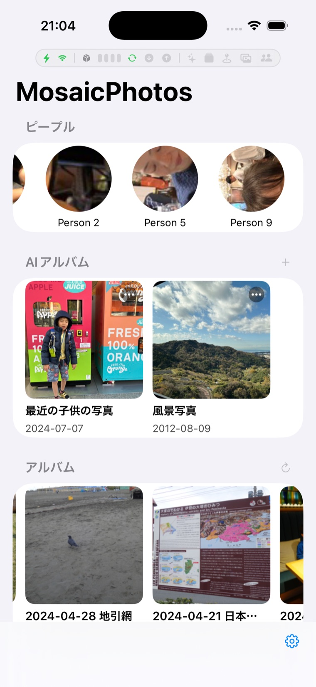
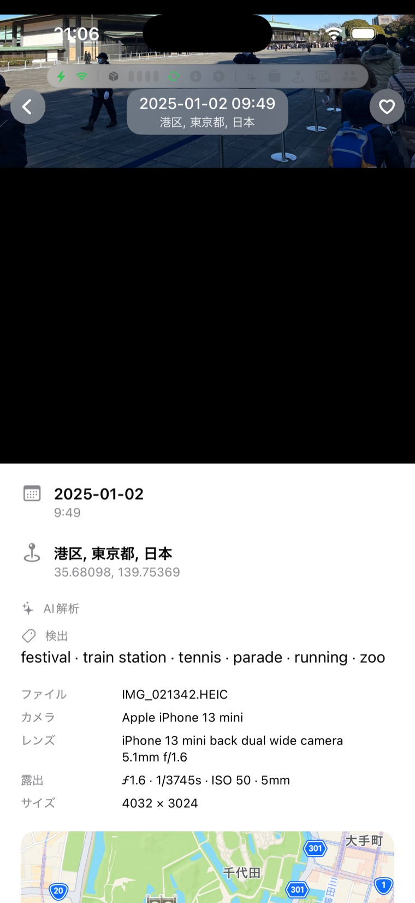
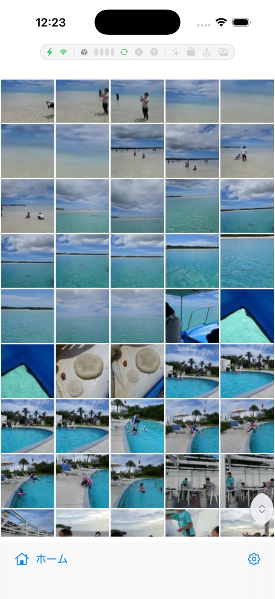
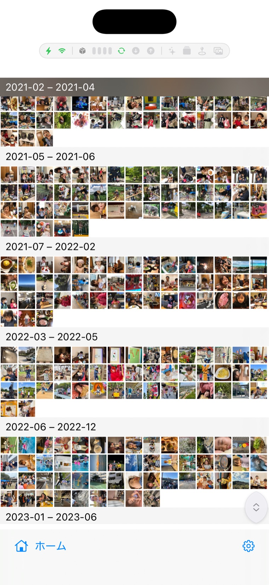

<p align="center">
  
</p>

<h1 align="center">MosaicPhotos</h1>

<p align="center">
  A privacy-first iOS photo viewer that unifies your <b>device library</b> and <b>Dropbox</b> into one experience — built entirely with standard Apple frameworks, <b>no third-party SDKs</b>.
</p>

<p align="center">
  <a href="https://github.com/kanairyoji/MosaicPhotos/actions/workflows/ci.yml"></a>
  <a href="https://github.com/kanairyoji/MosaicPhotos/actions/workflows/codeql.yml"></a>
  <a href="LICENSE"></a>
  
  
  
  
  <a href="https://kanairyoji.github.io/MosaicPhotos/architecture-note/"></a>
</p>

<p align="center">
  <b>English</b> | <a href="README.ja.md">日本語</a>
</p>

---

## Overview

**MosaicPhotos** lets you browse the photos on your iPhone and the photos stored in your Dropbox side by side: a single merged timeline, your device albums, on-device **People** clustering, and an automatic **Places** view that groups photos by city — all in a clean SwiftUI interface. Dropbox is integrated directly over its HTTP API with OAuth 2.0 + PKCE; there is no Dropbox SDK and no analytics.

## Screenshots

<table>
<tr>
<td align="center" width="50%">
  <br>
  <b>Home</b><br>
  <sub>Your device and Dropbox photos in one place — plus <b>Time&nbsp;&amp;&nbsp;Place</b> trips grouped automatically from when and where they were taken, and <b>People</b> clustered on device.</sub>
</td>
<td align="center" width="50%">
  <br>
  <b>AI Albums — describe it</b><br>
  <sub>Describe an album in plain words, in any language. The composer suggests people, places and frequent subjects from <i>your</i> library as tappable chips, and shows live how your words are interpreted — before you even create the album.</sub>
</td>
</tr>
<tr>
<td align="center" width="50%">
  <br>
  <b>People &amp; AI albums</b><br>
  <sub>Faces are detected and clustered entirely on device — across device <i>and</i> Dropbox photos. Tap a person to browse their photos, long-press to rename, merge duplicates or change the cover. Named people can be searched in AI albums (“photos of Taro and Hanako”).</sub>
</td>
<td align="center" width="50%">
  <br>
  <b>Photo info &amp; EXIF</b><br>
  <sub>Open any photo for place, date, full EXIF (camera, lens, exposure) and a map — plus detected scene tags, face count, screenshot badge and (for favorites) an AI description, all generated on device.</sub>
</td>
</tr>
<tr>
<td align="center" width="50%">
  <br>
  <b>Cloud (Dropbox)</b><br>
  <sub>Browse Dropbox photos in a pinch-to-resize grid. Background delta sync keeps it fresh; thumbnails and originals are cached locally.</sub>
</td>
<td align="center" width="50%">
  <br>
  <b>Dense month grouping</b><br>
  <sub>Months with few photos are packed together under date-range headers (e.g. “2021-02 – 2021-04”) so the grid stays dense; adjustable in Settings → Photo Grid.</sub>
</td>
</tr>
</table>

<sub>Screenshots captured in the iOS Simulator.</sub>

## Features

- **All Photos** — Your device and Dropbox photos merged into one chronological timeline.
- **Filters everywhere** — Every grid (sources, albums, People, Places, AI albums) has a filter button in the bottom bar: show **favorites only**, and on mixed views restrict to **device-only or cloud-only** photos. Full-screen swiping follows the filtered set.
- **People** — Faces are detected and clustered **entirely on device**: Vision face detection plus a bundled face model (facenet InceptionResnetV1 / VGGFace2, MIT, 512-dim identity embeddings) groups faces into people — iOS exposes no public “People” API, so the clusters are the app's own, built with no network access. Covers **both device and Dropbox photos** (cloud faces are detected from cached thumbnails — no extra downloads). Home shows a circular-avatar carousel: tap a person to browse their photos (device + cloud), long-press to rename, choose a cover, fix mis-assigned faces, or **merge two people** when the same person got split. Named people ground people conditions in AI albums — “Taro and Hanako” finds 山田太郎 and 山田花子, evaluated live against the current clusters so renames apply immediately. The section is hidden when the face model isn't bundled.
- **Time & Place** — Trips are detected automatically from capture time and location (multi-day, multi-city trips become a single album), with smart titles and covers.
- **AI Albums & semantic search** — Describe an album in natural language, in **any language** (e.g. “走っている子供” / “a running child”, or “Kyoto or Nara family favorites, no screenshots”). The composer helps you write queries that hit: **suggestion chips** built from your library (named people, frequent places, frequently-seen subjects, date phrases — all guaranteed to match), a **live interpretation preview** (colored chips showing how your words ground to people / places / visual words / dates), and a **live count** of photos matching the hard conditions. Creation is **two-stage**: a deterministic **preview** appears within a second or two (lexicon + date + tag matching, no LLM), then the album is **finalized in the next background window** (typically overnight) — the request is interpreted **once** by the on-device LLM (Apple Foundation Models, persisted; deterministic parsers ground dates, places, people names and common visual words), expanded with **paraphrase probes** (max-over-probes scoring recovers rephrasings the main query would miss), and matched by a **layered, threshold-free pipeline**: calibrated **scene tags** + **CLIP contrast** + lexical match fused with Reciprocal Rank Fusion, an **evidence gate**, **on-demand captions** for top candidates, and a final **LLM review** with majority voting. Exclusions like “without people” combine real **face detection counts** with tag and CLIP evidence. Works across **both device and Dropbox** photos. Search quality is tracked with a **Recall@k regression harness** (see `docs/architecture-note/records/model-evaluations.md`).
- **On-device image understanding** — Photos are indexed in the background, **newest photos first**, in three passes: **scene tags** (built-in Vision classifier, ~1,300 classes, precision-calibrated) and **CLIP embeddings** (OpenCLIP ViT-B-32, INT8-quantized — half the size at equal accuracy) for **all** photos, plus **VLM captions** (bundled SmolVLM-500M) for **favorite photos** — captioning is the heaviest pass, so it is focused where it matters; AI-album candidates also get captions on demand during review. Progress is visible in **Settings → AI Analysis Status** (per-pass progress, last-run times, an *Analyze Now* button, and a review screen showing generated descriptions next to their photos). By default, heavy work runs **only while the phone is charging, on Wi-Fi, and not in use** — including while locked (BGProcessingTask); the timing is user-selectable in five steps (see below). No OCR, no third-party vision API, no network.
- **Photos** — Browse your on-device library via PhotosKit, with fast thumbnail caching and a pinch-to-resize grid.
- **Cloud** — Browse Dropbox photos. Background delta sync keeps the list fresh; thumbnails (256 px) and originals are cached locally.
- **Albums** — Your user-created device albums, scanned and cached independently.
- **Places** — Photos grouped by city using **on-device reverse geocoding**, combining located photos from both the device and Dropbox. Grows automatically as more location data arrives.
- **Settings & Backup** — Connect Dropbox, tune cache limits, and back up device photos to Dropbox (with people / album / favorite metadata).
- **Background work, battery & data** — Two independent controls keep battery and cellular data in check.
  - **Processing Timing** (Settings → Albums & Search → Auto Albums) decides **when the heavy AI work runs** (scene tags, CLIP embeddings, captions, face scanning, album generation), in five steps: *Paused — manual only* · *Automatic — while not in use* (**default**: charging + Wi-Fi + app not in use, including locked via BGProcessingTask) · *Also while using the app (charging)* · *Also on battery (Wi-Fi)* · *No limits (mobile data too)*. At every level, Low Power Mode and memory pressure always pause the work.
  - **Background & Battery** (Settings → General) is the app-wide policy for the remaining continuous/periodic background work (Dropbox sync, backup, scanning): **power** (While charging / Always / Off — default *While charging*) and **network** (Cellular allowed / Wi-Fi only / Wi-Fi, skip Low Data / Off — default *Wi-Fi only*). Photos you open or browse are always fetched — only automatic background traffic is limited. An optional top-of-screen **activity bar** visualizes power/network state and live background/Dropbox activity.
- **Built for large libraries** — Designed for tens of thousands of photos: metadata and image vectors are paged and stored compactly (Float16). Under memory pressure the app records diagnostics and **proactively frees image caches** to stay stable instead of crashing.

> Viewing modes shared across every source: **dense**, **month**, and **year** grid layouts, pinch-to-resize, full-screen paging, and an EXIF info panel (camera, aperture, ISO, focal length). The **month** layout packs sparse months together under date-range headers so months with few photos don't leave gaps; density adjustable in **Settings → General → Photo Grid**.

## Architecture

The app is split into focused local Swift Package Manager modules. Logic layers are UI-free so they can be unit-tested on macOS with `swift test`.

```
MosaicPhotos (app)
├── MosaicSupport     cross-cutting utilities (logging, diagnostics, memory budget), no dependencies
├── PhotoSourceKit    shared photo-source interface (PhotoStore / PhotoItem / PhotoFilter) + grid & paging views
├── ImageCacheKit     image cache primitives (memory + disk I/O), SwiftUI-free
├── LocalPhotoCore    device-photo logic (PHAsset store, albums, thumbnail cache)
├── LocalPhotoKit     device-photo UI (depends on LocalPhotoCore)
├── DropboxCore       Dropbox logic — OAuth/PKCE, HTTP API client, sync engine, cache (SwiftUI-free)
├── DropboxKit        Dropbox UI layer (depends on DropboxCore)
├── BackupKit         device → Dropbox backup engine
├── PhotosFeatureKit  merges local + Dropbox (MergedPhotoStore) and place grouping
├── AutoAlbumCore     auto albums + on-device AI logic (SwiftUI-free): Time & Place trips,
│                     folder-name albums, composable query model (OR/NOT), search & fusion,
│                     face clustering, composer suggestions & grounding preview
└── MobileCLIPKit     AI runtimes + AutoAlbumCore seam implementations (CLIP, Vision scene
                      tags, SmolVLM captions + GPT2 tokenizer, face model, display labeler)
```

- **Logic vs. UI separation** — `DropboxCore` (logic) and `DropboxKit` (UI) are separate packages; `DropboxCore` never imports SwiftUI.
- **Dependency-injection seams** — networking (`HTTPClient`), time (`DateProvider`), and tokens (`AccessTokenProvider`) are protocols, so the sync engine, batcher, auth, and backup are testable without the network.

### On-device AI — how it works

All AI lives in **`AutoAlbumCore`** (SwiftUI-free); the app injects the on-device implementations.

- **Embeddings** — Each photo (device *and* Dropbox) is encoded once with **OpenCLIP ViT-B-32 (DataComp)** (Core ML, 512-dim, **INT8 weight-quantized** — 289 → 145 MB with accuracy unchanged, verified by a Core ML benchmark: 75.0 % → 76.0 % zero-shot top-1). Vectors live in a **separate SwiftData table (`PhotoEmbedding`) stored as Float16**, so metadata fetches never load the blobs. A `PhotoTagger` fills these in the background in small throttled batches, **newest photos first**, so recent shots reach search fastest. Cloud photos are embedded from their cached 256 px thumbnails.
- **Scene tags & captions** — Alongside CLIP, every photo gets **scene tags** from the built-in Vision classifier (~1,300 classes, precision-calibrated with `hasMinimumRecall(forPrecision:)`). If the optional **SmolVLM-500M** model is bundled (`scripts/build_smolvlm.sh`, Apache-2.0; vision encoder INT8-quantized, language decoder fp16 — small LLMs are argmax-sensitive to weight quantization), **favorite photos** get a one-sentence **English caption** (captioning is the heaviest pass; focusing it on favorites keeps it practical — AI-album candidates are additionally captioned on demand during review). Model choices are grounded in measured comparisons — see [`records/model-evaluations.md`](docs/architecture-note/records/model-evaluations.md) (CLIP INT8 vs. TinyCLIP; SmolVLM-500M vs. FastVLM vs. Florence-2, which was adopted and then **withdrawn** after on-device ANE/GPU fp16 broke its cross-attention).
- **Two-stage album creation** — Creating an AI album shows a **deterministic preview** immediately (lexicon + date + tag matching, no LLM), then the album is **finalized in the next background window** (LLM interpretation + paraphrase probes + evidence gate + on-demand captions + LLM review), typically overnight. The composer assists input with **library-derived suggestion chips**, a **live grounding preview** and a **hard-condition hit count** — all driven by the same deterministic layers as the real search, so the preview never lies.
- **Interpretation** — A request is interpreted **once** when the album is created (Apple Foundation Models, guided generation) and persisted with a version. Small on-device LLMs produce unreliable structure, so the output is defensively sanitized and grounded by deterministic layers: dates come from `RelativeDateParser` (JA/EN) only, places must match the catalog or the original text, people names ground against the current face clusters (`PersonNameGrounder` — “太郎” finds 山田太郎, evaluated **live** so renames and merges apply immediately), and a small `JapaneseVisualLexicon` extracts common visual words and people-negations even when the LLM fails. The LLM also generates up to four **paraphrase probes**, persisted with the interpretation; semantic scoring takes the **max over probes**, which measurably recovers rephrasings (member recall +17 pt on the paraphrase suite).
- **Search** — Hard conditions filter first (`QueryEvaluator`), then three signals are fused with **Reciprocal Rank Fusion**: **tag matches** (discrete, threshold-free), **CLIP contrast** (positive vs. per-exclusion negative embeddings; probes are disabled for exclusion albums so the contrast stays strict), and lexical matches. Exclusion-bearing albums pass an **evidence gate**, top candidates without captions get one **generated on demand**, and finally an **LLM review** (`AlbumVerifier`) keeps/drops each candidate from its evidence line, re-judging unsure cases with majority voting. Re-evaluation is incremental — only newly indexed photos are scored and merged into a persisted score pool. Quality is guarded by a **Recall@k harness** (`SearchQualityTests`, Imagenette fixture + 28 labeled queries) that runs the real pipeline.
- **Seams** — Perception (`PhotoPerceptionProvider`, `TagPerceptionProvider`, `FacePerceptionProvider`), text (`TextEmbedder`, `QueryTranslator`), and review (`AlbumCandidateVerifier`) are protocols in `AutoAlbumCore`; **`MobileCLIPKit`** implements them, and the app's composition root wires them in. `PhotoSourceKit` stays unaware of AI and receives per-photo info through a `photoInsight` environment closure.

## Documentation

An in-depth internal **architecture note** — design rationale (ADR), deep-dive implementation pages (concurrency, caching, data model), model-evaluation records, and a general, app-independent AI primer — is available as a multi-page HTML site:

- **[Architecture Note → kanairyoji.github.io/MosaicPhotos/architecture-note](https://kanairyoji.github.io/MosaicPhotos/architecture-note/)** — published via GitHub Pages (diagrams via Mermaid). Source: [`docs/architecture-note/`](docs/architecture-note/). End-user **[Help guide](https://kanairyoji.github.io/MosaicPhotos/help/)** is also published (source: [`docs/help/`](docs/help/)).

> ⚠️ **The architecture note is written in Japanese only.** Its master records live as Markdown in `docs/architecture-note/records/` (ADRs, case studies, model evaluations).

## Tech Stack

| Area | Technology |
|---|---|
| Language / UI | Swift · SwiftUI |
| State | Swift Observation (`@Observable`) |
| Device photos | PhotosKit (`PHPhotoLibrary`, `PHImageManager`) |
| Dropbox auth | `AuthenticationServices` (`ASWebAuthenticationSession`, OAuth 2.0 + PKCE) |
| Token storage | Keychain Services |
| Dropbox API | `URLSession` async/await (no SDK) |
| Caching | SwiftData (metadata) + custom binary cache with LRU eviction |
| On-device AI | Vision image classification (built-in, ~1,300 classes) · OpenCLIP ViT-B-32 (DataComp/MIT, INT8) embeddings · SmolVLM-500M captions (Apache-2.0, optional, favorites) · facenet InceptionResnetV1 face embeddings for People clustering (VGGFace2/MIT, optional) — all Core ML · Apple Foundation Models for interpretation, translation, probe expansion & candidate review |
| Minimum OS | iOS 26 |
| Packaging | Swift Package Manager (11 local packages) |

## Privacy & Security

- **No third-party SDKs** — everything uses standard Apple frameworks.
- **OAuth 2.0 + PKCE** for Dropbox; access/refresh tokens are stored in the **Keychain**, never in plain files.
- **On-device processing** — reverse geocoding, EXIF parsing and all AI (tags, embeddings, captions, faces, LLM) happen locally.
- No analytics, no tracking.

## Build & Test

```bash
# Build (iOS Simulator)
xcodebuild -project MosaicPhotos.xcodeproj -scheme MosaicPhotos -sdk iphonesimulator build

# Run the full test suite (packages: macOS fast + iOS Simulator)
scripts/test.sh all

# Subsets
scripts/test.sh fast   # macOS swift test (pure logic)
scripts/test.sh ios    # iOS Simulator package tests
```

### On-device AI models (optional)

The AI models are **not committed** (size) and are generated locally; without them the app still runs fully — only the corresponding AI features are disabled (date/place/people filters keep working).

```bash
bash scripts/build_mobileclip.sh   # OpenCLIP ViT-B-32 (DataComp, MIT) → Core ML, INT8 (semantic search & tags)
bash scripts/build_smolvlm.sh      # SmolVLM-500M (Apache-2.0) → Core ML (AI descriptions, favorites)
bash scripts/build_facenet.sh      # facenet (VGGFace2, MIT) → Core ML (People clustering)
```

## License

Source code is licensed under the **GNU Affero General Public License v3.0 or later (AGPL-3.0-or-later)** — see [LICENSE](LICENSE).

**Dual distribution:** in addition to the AGPL, the copyright holder (Ryoji KANAI) also distributes the compiled app via the Apple App Store under Apple's standard terms (see [NOTICE](NOTICE)). Contributions are accepted under the DCO with a relicensing grant — see [CONTRIBUTING.md](CONTRIBUTING.md).

Third-party assets are listed in-app under **Settings → Licenses** (and in `MosaicPhotos/Settings/Licenses.swift`): the bundled CLIP model is **OpenCLIP ViT-B-32 (DataComp, MIT)**, captions use **SmolVLM-500M-Instruct (Apache-2.0)**, the CLIP BPE vocabulary / tokenizer (MIT), build tools (coremltools, PyTorch, open_clip, transformers, Pillow, NumPy), and Mermaid (docs). Apple SDKs and SF Symbols are used under Apple's terms.
